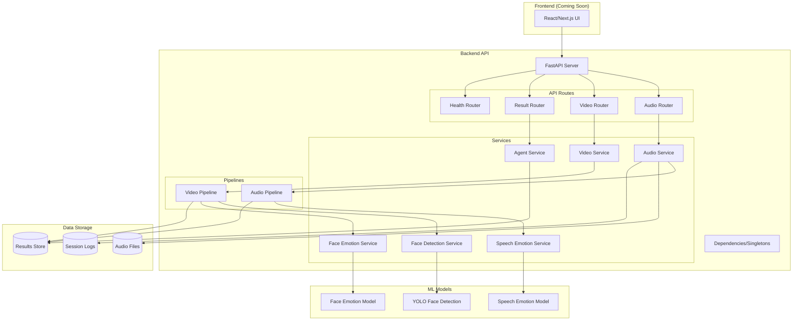

# AI Monitor - System Architecture

## Overview

AI Monitor is a real-time customer satisfaction monitoring system that analyzes audio and video streams to determine customer emotional state and satisfaction levels.

## System Architecture



## Component Breakdown

### Frontend Layer (Planned)
- **Technology**: React/Next.js with TypeScript
- **Responsibilities**:
  - Real-time monitoring dashboard
  - Session management
  - Results visualization
  - Analytics and reporting

### API Layer
- **Technology**: FastAPI
- **Entry Point**: `backend/app/main.py`
- **Responsibilities**:
  - HTTP request handling
  - Route management
  - CORS configuration
  - API documentation (Swagger/ReDoc)

### Service Layer
- **Audio Service**: Manages audio recording lifecycle
- **Video Service**: Handles video capture and processing
- **Agent Service**: Makes final satisfaction decisions
- **ML Services**: Wraps ML models for inference

### Pipeline Layer
- **Audio Pipeline**: Processes recorded audio through emotion model
- **Video Pipeline**: Processes video frames for face detection and emotion

### Model Layer
- **Speech Emotion**: Transformer-based audio emotion classifier
- **Face Detection**: YOLO-based face detector
- **Face Emotion**: ONNX emotion classifier for faces

### Data Layer
- **Audio Files**: Stored in `backend/data/audio/`
- **Session Logs**: Metadata in `backend/data/logs/`
- **Results Store**: In-memory store for session results

## Data Flow

### Audio Processing Flow

```
1. User → POST /audio/start-record
2. AudioService starts recording thread
3. Audio frames captured continuously
4. User → POST /audio/stop-record
5. AudioService saves WAV file
6. Background task → AudioPipeline.run()
7. SpeechEmotionService processes audio
8. Results stored in audio_results_store
9. User → GET /audio/latest-result
10. Return satisfaction scores
```

### Video Processing Flow

```
1. User → POST /video/start-session
2. VideoService starts capture thread
3. Frames → VideoPipeline queue
4. Pipeline worker processes frames:
   - FaceDetectionService finds faces
   - FaceEmotionService classifies emotions
5. Aggregated stats updated continuously
6. User → GET /video/stats (real-time)
7. User → POST /video/stop-session
8. Return final statistics
```

### Result Analysis Flow

```
1. User → POST /result/analyze
2. AgentService receives:
   - Audio summary (from audio_results_store)
   - Video summary (from VideoService)
3. Agent applies business rules
4. Returns final satisfaction state:
   - SATISFIED
   - NEUTRAL
   - DISSATISFIED
```

## Key Design Decisions

### 1. Singleton Services
All services are initialized once in `dependencies.py`:
- Avoids repeated model loading
- Shares state across requests
- Improves performance

### 2. Background Processing
Audio processing runs in background tasks:
- Non-blocking API responses
- Better user experience
- Status polling for results

### 3. In-Memory Store
Session results stored in memory:
- Fast access
- Simple implementation
- Suitable for single-server deployment
- **Future**: Replace with Redis for multi-server

### 4. Separate Models and Data
Models and data outside `app/`:
- Easier Docker volume mounting
- Avoids working directory issues
- Better separation of concerns

## API Contract

### Audio Endpoints

| Endpoint | Method | Purpose |
|----------|--------|---------|
| `/audio/start-record` | POST | Start recording |
| `/audio/stop-record` | POST | Stop and process |
| `/audio/live-metrics` | GET | Real-time metrics |
| `/audio/status` | GET | Session status |
| `/audio/latest-result` | GET | Processing results |

### Video Endpoints

| Endpoint | Method | Purpose |
|----------|--------|---------|
| `/video/start-session` | POST | Start capture |
| `/video/stop-session` | POST | Stop and get results |
| `/video/stats` | GET | Current statistics |
| `/video/frame` | GET | Latest frame |

### Result Endpoints

| Endpoint | Method | Purpose |
|----------|--------|---------|
| `/result/analyze` | POST | Final analysis |

## Deployment Architecture (Planned)

```
┌─────────────────┐
│   Nginx Proxy   │
│   (Port 80/443) │
└────────┬────────┘
         │
    ┌────┴────┐
    │         │
┌───▼───┐ ┌──▼──────┐
│Frontend│ │ Backend │
│ Next.js│ │ FastAPI │
│ (3000) │ │ (8000)  │
└────────┘ └────┬────┘
                │
         ┌──────┴──────┐
         │             │
    ┌────▼────┐   ┌───▼────┐
    │ Models  │   │  Data  │
    │ Volume  │   │ Volume │
    └─────────┘   └────────┘
```

## Technology Stack

### Backend
- **Framework**: FastAPI 0.100+
- **ML Framework**: PyTorch 2.0+
- **Audio Processing**: librosa, sounddevice
- **Video Processing**: OpenCV, YOLO
- **Model Format**: SafeTensors, ONNX
- **Python**: 3.10+

### Frontend (Planned)
- **Framework**: Next.js 14+
- **Language**: TypeScript
- **Styling**: TailwindCSS
- **State**: React Query
- **Real-time**: WebSocket

### Infrastructure (Planned)
- **Containerization**: Docker
- **Orchestration**: docker-compose
- **Reverse Proxy**: Nginx
- **CI/CD**: GitHub Actions

## Performance Considerations

### Audio Processing
- **Recording**: Non-blocking thread
- **Processing**: Background task
- **Model**: Loaded once at startup
- **Typical latency**: < 5s for 40s audio

### Video Processing
- **Capture**: 15 FPS (optimized)
- **Resolution**: 640x480 (optimized)
- **Processing**: Separate worker thread
- **Frame queue**: Prevents blocking

### Model Optimization
- **CPU Threads**: Limited to 2 (for i7-1260P)
- **ONNX Runtime**: Optimized for CPU
- **Batch Size**: 1 (real-time)

## Security Considerations (Future)

- [ ] Add authentication/authorization
- [ ] Rate limiting
- [ ] Input validation
- [ ] HTTPS enforcement
- [ ] Secure model storage
- [ ] Data encryption at rest

## Monitoring and Logging (Future)

- [ ] Structured logging
- [ ] Performance metrics
- [ ] Error tracking (Sentry)
- [ ] Health checks
- [ ] Resource monitoring

## Scalability Path

### Current: Single Server
- In-memory store
- Single process
- Local file storage

### Future: Multi-Server
- Redis for session store
- Message queue (RabbitMQ/Kafka)
- S3 for file storage
- Load balancer
- Horizontal scaling
